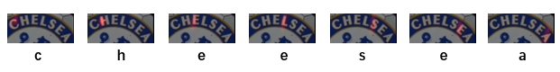
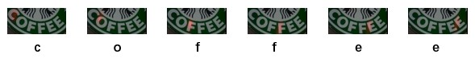

# Show, Attend and Read: A Simple and Strong Baseline for Irregular Text Recognition [AAAI-2019]
## Introduction
This is an unofficial implementation of [Show, Attend and Read: A Simple and Strong Baseline for Irregular Text Recognition](https://arxiv.org/pdf/1811.00751.pdf)  
Official Torch implementation can be found [here](https://github.com/wangpengnorman/SAR-Strong-Baseline-for-Text-Recognition)  
Another PyTorch implementation can be found [here](https://github.com/jichilen/SAR_quick)
## How to use
### Install
```
pip3 install -r requirements.txt
```
### Demo
- Download the pretrained model from [BaiduYun](https://pan.baidu.com/s/1DWXxqpmaxhMWlXqEpDpMkg) and unzip it.  
- Run
```
python3 test.py --test_data_dir ./demo_data --checkpoints ./sar_synall_lmdb_checkpoints_2epochs -g "0" --vis_dir ./visualize
```
- Results will be printed and attention weights visualizing images can be found in directory './visualize'  

### Train
* <b> Data prepare</b>
LMDB format is suggested. refer [here](https://github.com/bgshih/crnn/blob/master/tool/create_dataset.py) to generate data in LMDB format.
Also raw images with annoation file (json or txt) is also supported. The stucture of annoation file please refer to [txt]() or [json]()
* <b> Run</b>
LMDB:
```
python3 train.py --checkpoints /path/to/save/checkpoints --train_data_dir /path/to/your/train/LMDB/data/dir --test_data_dir /path/to/your/test/LMDB/data/dir  -g "0"
```  
Raw images:
```
python3 train.py --checkpoints /path/to/save/checkpoints --train_data_dir /path/to/your/train/images/dir --train_data_gt /path/to/your/train/annotation/file(txt or json) --test_data_dir /path/to/your/test/images/dir --test_data_gt /path/to/your/train/annotation/file(txt or json) -g "0"
```  
More super parameters please refer to [config.py]()  

### Test
Similar to demo and you can also provide annotation and it will calculate accuracy
```
python3 test.py --test_data_dir /path/to/your/test/images/dir --test_data_gt /path/to/your/test/annotation/file(optional) --checkpoints /path/to/trained/checkpoints -g "0"
```  

## Reproduced results

|            |  IC13  |  IC15  |  SVTP  |  CUTE  |
|:----------:|:------:|:------:|:------:|:------:|
|  Official  |  91.0  |  69.2  |  76.4  |  83.3  |
|  This One  |  91.8  |  69.6  |  75.1  |  83.6  |

## Examples

